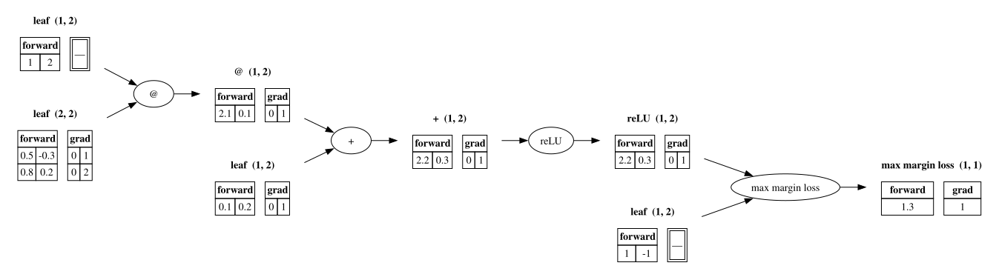

# macrograd

A tiny **matrix-based autograd engine** — [micrograd](https://github.com/karpathy/micrograd), but operating on whole matrices instead of single scalars. Built from scratch to actually understand how backpropagation works under the hood.

> **Status: training end-to-end.** A 5-layer ReLU net (`main.py`) trains
> from loss 26.5 to **exactly 0.0** in 21 epochs — weight updates now run
> through guarded **in-place ops** (`w -= lr * w.grad` mutates the parameter
> instead of replacing it) under the `Matrix.no_grad()` context manager.
> The pytest migration is done: **31 green, 0 red**. Core ops are verified
> against numerical (finite-difference) gradients to ~3e-10; extending that
> harness to every op is the next milestone. The `nn/` layer library stays
> removed until then. No numpy, no torch — just nested lists.

<p align="center">
  
</p>
<p align="center"><em>The engine drawing its own backward pass — one neuron layer, forward values and gradients side by side in every node. See <a href="#visualizing-the-graph">Visualizing the graph</a>.</em></p>

## Why "macro"?

Karpathy's micrograd builds an autograd engine over scalar `Value` objects. **macrograd scales that up to `Matrix` objects** — matmul, broadcasting, Hadamard (element-wise) ops, ReLU — which is much closer to how real frameworks like PyTorch actually compute. Same core idea (build a graph on the forward pass, walk it backward for gradients), bigger unit of work.

Learning project from [Neural Networks: Zero to Hero](https://karpathy.ai/zero-to-hero.html).

## The engine

The `Matrix` class (`engine/matrix.py`) builds a computational graph as you compute. Each `Matrix` tracks its `elements`, a `grad` (itself a `Matrix`), its input nodes (`_inputs`), the op that produced it (`_op`), and a local `_backward` closure.

- **Forward ops:** `__matmul__` (matrix multiply), `transpose`, `hadamar_sum` (element-wise add), `hadamar_product` (element-wise mul), `exp`, `log`, `relu`, `max_margin_loss`, `cross_entropy_loss` (fused softmax + NLL, WIP)
- **Operator overloads:** `+`, `-`, `*`, `/`, `**`, unary `-`, and `@` for matmul — operands can be raw Python scalars, they get wrapped automatically
- **Broadcasting:** `_should_broadcast` decides which side broadcasts; `_broadcast` expands along any size-1 axis (`(1,1)`, `(1,m)`, `(n,1)`), and its backward **sum-reduces** the gradient back along exactly those axes
- **Backward pass:** every op has a real `_backward`; `backwards()` builds the topological order, seeds `dL/dL = 1`, and walks the graph in reverse to accumulate gradients (skipping non-grad constants via `has_grad`)
- **No-grad mode:** `with Matrix.no_grad():` disables graph recording, PyTorch-style — a class-level flag checked once in `__init__` means every `Matrix` built inside the block comes out as a leaf (no `_inputs`, no `_backward`). This exists because `w -= lr * w.grad` is itself made of engine ops: without it, every weight update got *recorded into the graph*, and the next epoch's backward walked into last epoch's history and crashed on grad-less constants — the same reason PyTorch makes you wrap updates in `torch.no_grad()`
- **Guarded in-place ops:** `__isub__`/`__iadd__` mutate `elements` and return the *same* object, so a weight survives its own update — an out-of-place `w = w - ...` inside `no_grad` re-creates the parameter as a grad-less constant and silently freezes training after one epoch (PyTorch's classic footgun, faithfully reproduced here before being fixed). The guard raises on in-place writes to grad-tracked matrices while autograd is recording, torch-style: backward closures read `elements`, so silent mutation would corrupt gradients
- **Verified:** analytic gradients match finite-difference numerical gradients to a max error of **3.3e-10** across all parameters of a 2-layer MLP

## Visualizing the graph

`Matrix.backwards(show_graph=True)` renders the computation graph with [Graphviz](https://graphviz.org/) after the backward pass — one node per `Matrix`, showing its op, shape, and **forward | grad values side by side**, with the operations drawn as their own nodes in between:

```python
loss.backwards(True)     # renders + opens the graph after the backward pass
```

Graphviz is imported lazily, so the engine only needs it when you actually turn this on (`uv add graphviz` + `brew install graphviz` for the `dot` binary). Best on small expressions — a full training-loop graph renders as a hairball.

## What's not done yet

- **Single-example only** — trains on one input→target pair; no dataset iteration / batching yet
- **The finite-difference harness is the next milestone** — the losses have
  hand-derived backwards and networks demonstrably train to zero, but the
  newer ops (`-`, `/`, `**`, `exp`, `log`, unary negate, `cross_entropy_loss`)
  still need the same numerical verification the core ops got. One
  parametrized gradient-check over every op closes the book on testing
- **`detatch()` is written but untested** — the per-tensor graph cut-off
  exists, but per house rules nothing counts as done before its tests pass
- The `nn/` layer library (DenseLayer / MLP) is gone — **on purpose**. The
  old design was drifting Keras-wards: stack some layer objects, call
  `epoch()`, and the actual forward/backward/update mechanics vanish
  behind the abstraction. I'd rather follow the PyTorch mentality — *you*
  write the forward pass and the training loop, and the library just
  hands you autograd and building blocks. (Yes, PyTorch offers
  `nn.Sequential` too, but the flexibility of explicit code is the point —
  and in a project whose whole reason to exist is *seeing* the process,
  I don't want to abstract it away behind simple layer calls, however
  simple it is right now.) `no_grad` is what makes that trade viable:
  writing the update step yourself is only safe if you can step outside
  autograd to do it — a freedom an `epoch()` abstraction would never
  surface. It'll come back as thinner, PyTorch-flavored modules once
  the loss machinery is gradient-checked

## Structure

```
macrograd/
├── engine/
│   └── matrix.py                          # the Matrix autograd engine (the heart of it)
├── tests/
│   ├── test_matrix_init_behaviour.py      # constructor contracts: scalars, jagged input, raised errors
│   ├── test_internal_method_behavior.py   # _dimensions + _should_broadcast/_broadcast across shapes
│   └── test_slice_of_life_methods.py      # zeros / ones / uniform / one_hot
├── main.py                                # the training demo: 5-layer ReLU net, max-margin loss
├── pyproject.toml                         # uv project, Python 3.13, pytest as the dev group
└── README.md
```

The old print-and-eyeball scripts (`mat_ops_test`, `backprop_mml_test`,
`backprop_nll_test`, `dunder_test`) are retired — their coverage now lives
as real assertions in `tests/`.

## Running it

Uses [uv](https://docs.astral.sh/uv/) with Python 3.13:

```bash
uv run pytest           # 31 passed
uv run python -m main   # 5-layer net: loss 26.5 -> 0.0 in 21 epochs, then holds
```

The exact zero is real, not rounding: max-margin is a hinge loss, so once
every prediction clears its margin the loss (and every gradient) is
literally 0.0 and the weights hold still.

## Roadmap

- [x] Fix matmul
- [x] Rework broadcasting to handle every shape (incl. scalar) + reduce on the backward
- [x] Finish `_backward` for every op (matmul, hadamard, relu, transpose, loss)
- [x] Get `backwards()` running end-to-end
- [x] Gradient-correctness check against numerical gradients
- [x] A minimal training loop — fit a tiny example end-to-end (max-margin, single example)
- [x] Graph visualization — `backwards(show_graph=True)` renders the graph (forward + grad per node)
- [x] Dedup the topo sort so shared nodes don't double-count gradients
- [x] Softmax + NLL training loop — `Matrix.no_grad()` keeps weight updates out of the graph; 100 epochs, loss 3.51 → 0.66
- [x] Pytest migration — 31 green, 0 red; print-and-eyeball scripts retired
- [x] Guarded in-place ops — `__isub__`/`__iadd__` keep parameters alive through updates; 5-layer net trains 26.5 → 0.0
- [ ] Finite-difference harness over every op (`-`, `/`, `**`, `exp`, `log`, unary negate, cross-entropy, `detatch`, broadcast paths) — the last testing milestone
- [ ] Train over a real dataset (iteration / batching)
- [ ] PyTorch-style indexing (`m[i, j]`)
- [ ] More ops / activations
